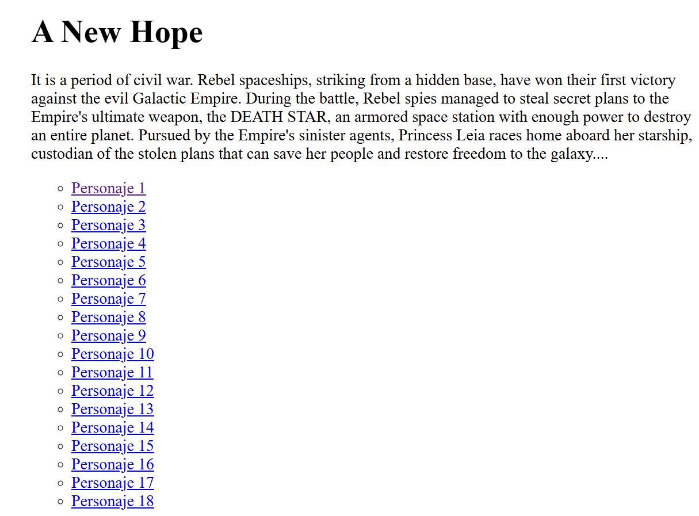
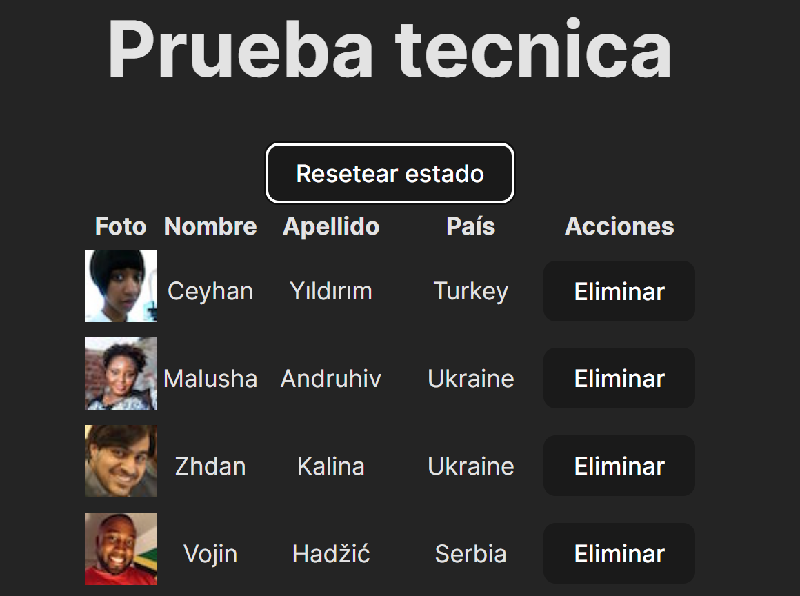

# Prueba tecnica React 1

1. Usando el API de Star Wars `[aqui](https://swapi.dev/)`, implemente una aplicacion que liste las peliculas de la saga, mostrando el titulo de la pelicula, el director, el productor, la fecha de estreno y el texto del opening. Además, cree una lista con los personajes que participan en la pelicula; ya que no tiene los nombres, la lista deberá decir Personaje 1, Personaje 2, etc. Pero al hacer click sobre cada Personaje, se debe consultar la información de dicho personaje y mostrar el detalle en pantalla. El detalle incluye el nombre, altura, masa, genero y año de nacimiento.
2. Los endpoints que debe usar son:
   1. /api/films
   2. /api/people/#
3. Modifique la aplicacion para mostrar la información cuando es cargada o en su defecto un mensaje de que el proceso de carga se está ejecutando
4. Agrege estilos para que la aplicación se vea mejor
5. Entregar un archivo README.md con las instrucciones de como ejecutar la aplicacion.
6. Ejemplo de lo que se quiere lograr: 

# Prueba tecnica React 2

El objetivo de esta prueba tecnica es el de usar el API https://randomuser.me/ y realizar los siguientes pasos

- [] Obtener 100 filas de datos usando el API.
- [] Desplegar la data en un formato tabla.
- [] Permitir que se pueda borrar una fila de la tabla.
- [] Implementar una funcionalidad que permita al usuario reestablecer el estado inicial, es decir que todas las filas borradas van a ser recuperadas.
- [] Manejar cualquier potencial error que pueda ocurrir.
- [] Agrege estilos para que la aplicación se vea mejor
- [] Entregar un archivo README.md con las instrucciones de como ejecutar la aplicacion.
- Ejemplo de lo que se quiere lograr: 
